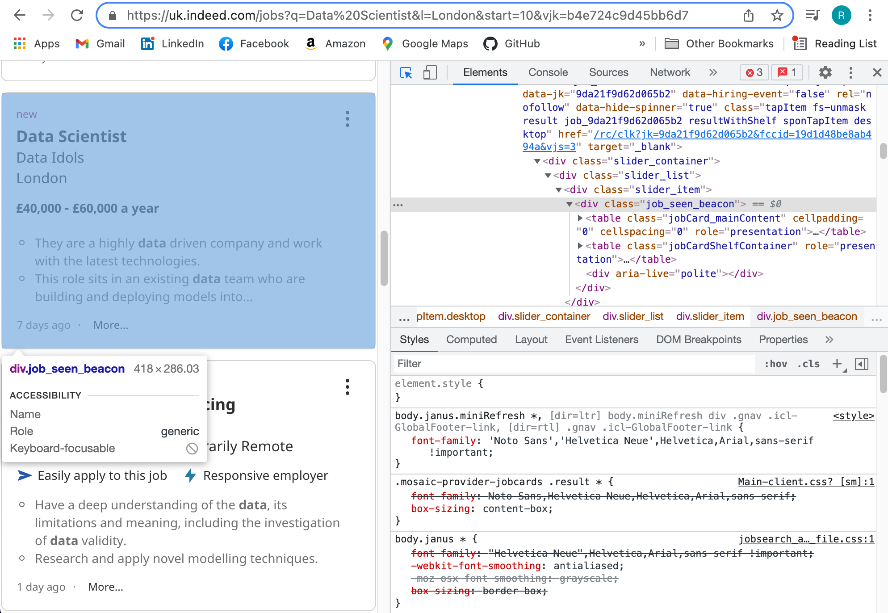
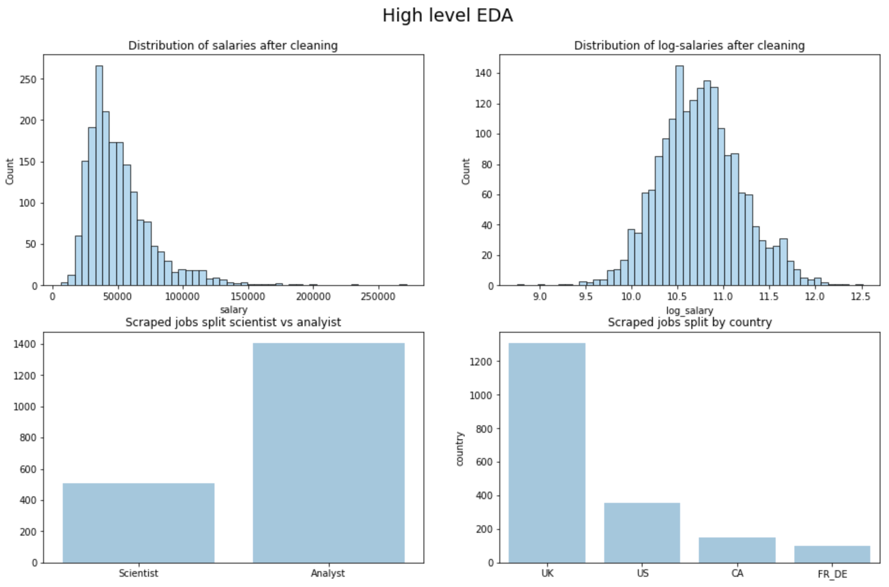
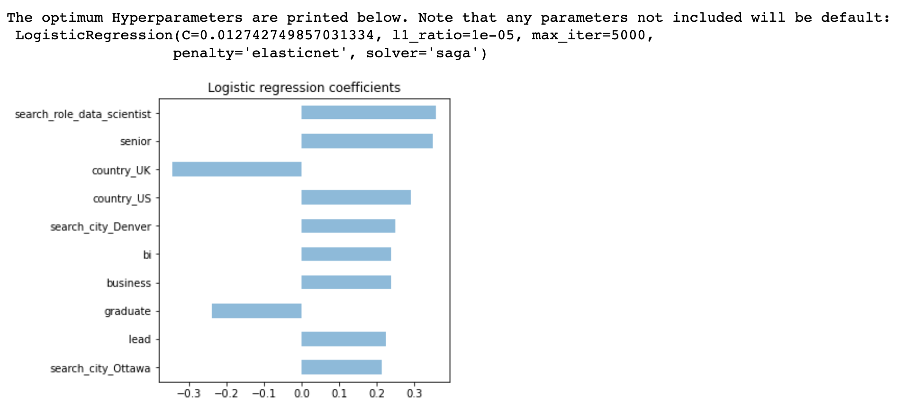
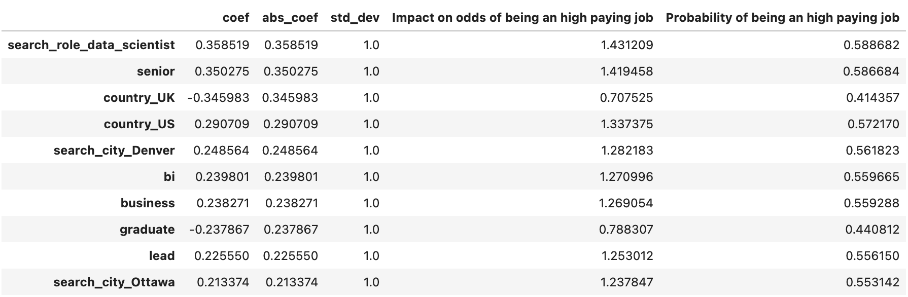
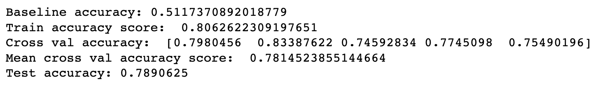
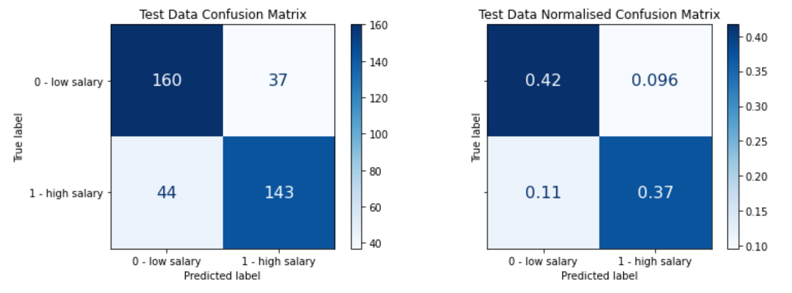
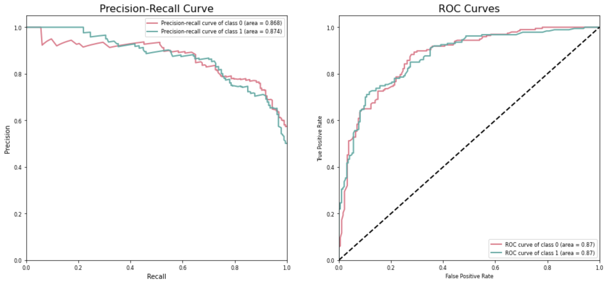
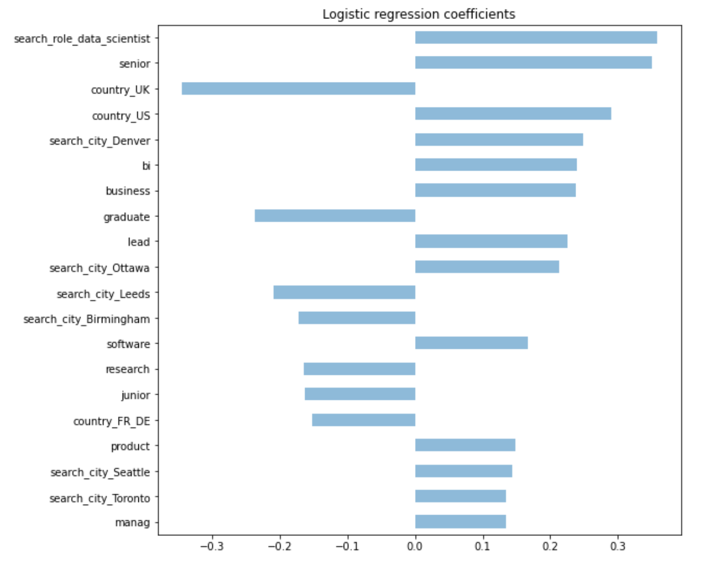

# $alaries in Data Roles

## Aims and the question

This challenge was posed in week 5 of the General Assembly DSI course as an exercise in web-scraping, natural language processing, classification modeling, and model evaluation.    

The primary aim was to web-scrape a dataset to be used to generate a classification model which describes the key factors in predicting the salaries for jobs oriented around data. The target was to predict whether a salary would be higher or lower than the median salary. The secondary aim was to describe the trade-off between precision and recall of the produced model, indicating how the model might be optimised in relation to a posed business case. 

## Web-scraping the data

Although there are many sources of job and salary information, it was encouraged to scrape the job aggregator [Indeed.com](https://www.indeed.com) as they regularly pool job postings from other sources.

With Google Chrome's Developer Tools function used to inspect HTML on a page of job search results, it was possible to identify a number of key tags for information which might be helpful to scrape. 

<kbd></kbd>

<i>Sample Indeed.com search result page with Developer Tools. The identified jobcard is highlighted in blue.</i>

 

Using the freshly identified tags and the Requests and Beautiful Soup Python libraries it was possible to extract the following job information from each job card on the web page:
* Job title
* Employer name
* Job location
* Job salary
* Job description

Successfully scraping information from a single web-page was a good start, but more data was required. Indeed.com was lacking in salary information for the vast majority of jobs so a large number of job search pages had to be scraped to built a large enough dataset for the classification model to work on. Fortunately the Indeed url could be manipulated for a variety of search criteria to return successive search pages which were then scraped for information by a function comprising of multiple nested for-loops. An example of the base URL is included below, with f-strings used to substitute the search parameters.

<kbd></kbd>

<i>Base f-string URL template.</i>

 

In order to maximise data points, the largest cities in the US, the UK, Canada, France and Germany were scraped for job information. In all, ~16,000 unique jobs were scraped, reducing to ~2,000 jobs with salary information. With web scraping complete it was time to progress to the data cleaning stage of this challenge.

## Data cleaning and EDA

A small amount of data cleaning was required prior to modeling:
* Daily, weekly and monthly figures were converted to corresponding annual figures.
* Jobs with salaries beneath £2000 per year were dropped - it is likely that they were not annual salaries but it was impossible to define what they were.
* Text and unicode characters were removed from the scraped salary information.
* Where a salary range was provided, the average was computed and substituted.
* Currencies were converted to GBP.
* Salary data were log transformed to obtain a normal distribution before outliers beyond 3*standard deviation were removed. 
* Finally a 'above median' binary target was created. Any salaries greater than the median salary were assigned 1, while others were assigned 0.

<kbd></kbd>

<i>Initial EDA overview after the stages above.</i>

 
  
## Feature engineering with NLP 

In order to generate some useful predictors from the scraped data, the nltk Python librarby was used in tandem with the sklearn CountVectorizer. The following pre-processing steps were taken on the job title information:
* Words within job titles were stemmed with PorterStemmer.
* The job title predictor was CountVectorised using stop words to obtain the top 40 occurring stemmed words.
* N-grams of length 1, 2 and 3 were trialed for optimising model accuracy. It was found that a simple n-gram of length 1 yields best results. 
* The produced matrix was joined with the existing predictors of 'city' and 'country' to form the predictor set.
* The predictor set and target set were then train-test split and standardised for input to modeling.

<kbd></kbd>

<i>Top 20 word occurrences after count vectorising the job title data. N-grams of length 1 were found to yield optimal results. </i>

## Building and optimising a classification model

Six classifiers from the sklearn package were tested as viable methods for predicting the 'above median' target variable; LogisticRegression, KNeighborsClassifier, DecisionTreeClassifier, SVC, RandomForestClassifier and ExtraTreesClassifier. Although a wide range was tested, we only focus on the optimal classifier in this summary - the LogisticRegression classifier. 

The optimum LogisticRegression parameterisation was found through use of a grid search with cross validation. Since some of the LogisticRegression parameters are only compatible with a specific penalty term, the elastic net penalty term was selected first. The reason behind this being that effective use of the l1_ratio parameter can allow the produced regularisation to act like a l1 or l2 penalty as required to optimise the classifier performance. The parameters chosen to grid search through were then:
* C, or inverse of regularisation strength with *np.logspace(-4,4,20).*
* l1_ratio, or the elastic net mixing paramater with *np.linspace(0.00001,1,10).*
* max_iter, or max iterations with [500,1000,5000,10000].
* cv, or cross validation used a StratifiedKfold with 5 splits and a shuffle.

This grid search yielded the optimum model described in the print-out below, with corresponding statistics.
 

<kbd></kbd>

<i>Optimum LogisticRegression estimator parameters and corresponding top ten model coefficients.</i>

The top ten model beta coefficients plotted above give a clear indication which predictors might lead to a salary above mean (high salary) and which predictors might lead to a salary below median (low salary). Because these variables have been standardised and the LogisticRegression produces log-odds beta coefficients by nature, the interpretation can become hairy! To convert from log-odds to odds we can use the exponential, but all conclusions must still be framed in the context of standard deviations of the predictor. To convert from odds to associated probability we use the equation: 
 

$ p = \frac{odds}{1+odds} $ 

 

<kbd></kbd>

<i>Top ten beta coefficients obtained from LogisticRegression with additional statistics to aid interpretation.</i>

An appropriate insight from these coefficients would be:
* In terms of odds, an increase in 1 standard deviation of the country_FR_DE predictor scales the odds of a high salary by 0.25. This is a negative predictor. 
* In terms of probability, a job being from country_FR_DE impacts the probability of it being a high salary job by 0.21 -  Approximately 1 in 5 jobs in country_FR_DE are classified as high salary.
* In terms of odds, an increase in 1 standard deviation of the senior variable multiplies the odds of a high salary by 3.32. This is a positive predictor.
* In terms of probability, a job containing the term senior in the title impacts the probability of it being a high salary job by 0.77 - Approximately 3 in 4 jobs with senior in the job title are classified as high salary.

## Results and model evaluation

Some typical statistics used to evaluate classification model performance are accuracy, precision, recall and AUC-ROC plots. Each of these metric will be used to evaluate the LogisticRegression model.

<kbd></kbd>

<i>Accuracy statistics for the LinearRegression model on training, cross validated training and testing datasets. Classification threshold of 0.5 used.</i>

Firstly, accuracy is addressed. This describes the fraction of salaries which were correctly predicted as high or low. Because the median salary value was used to define a high/low salary, the baseline model to beat would have an accuracy of 0.51, or 51%. The LinearRegression model yields an accuracy of 0.79, or 79% on the unseen testing dataset with a classification threshold of 0.5, which is 28% higher than the baseline.

The fact that the training dataset accuracy, the mean cross validated accuracy and the testing dataset accuracy can all be rounded to 78-79% indicates that the model generalises well and has low variance, i.e. the model does not over-fit. It performs equally well on the training data, on random subsets of the training data and on unseen data. 

Since it has been proven that the model generalises well, further model analysis will focus on the testing dataset from this point onwards. The plot below shows the test data confusion matrix, with a normalised version to the right. 

<kbd></kbd>

<i>Test data confusion matrices. These two matrices are generated from the same dataset. The right matrix has been normalised. Classification threshold of 0.5 used.</i>

While the accuracy score could correctly communicate that with a classification threshold of 0.5, 79% of jobs were correctly classified to be high/low salary, this figure can mask more granular detail that the confusion matrix does not. Reading from the normalised matrix on the right we can observe the following:
* 42% of jobs were correctly identified as low salary. This is a True Negative (TN).
* 37% of jobs were correctly identified as high salary. This is a True Positive (TP).
* 12% of jobs were incorrectly identified to be low salary when they were high salary in reality. This is a False Negative (FN).
* 9%  of jobs were incorrectly identified to be high salary when they were low salary in reality. This is a False Positive (FP).

Using the granular statistics depicted in the normalised confusion matrix new metrics can be constructed which are commonly used to evaluate the model performance for the full range of classification thresholds between 0 and 1:

> **`precision = tp / (tp + fp)`**

> **`recall = true positive rate = tp / (tp + fn)`**

> **`false positive rate = fp / (tn + fp)`**

The definitions above are used to generate a plot of the precision-recall relationship and the AUC-ROC curve for the range of possible classification thresholds as seen below

<kbd></kbd>

<i>Precision-Recall relationship and AUC-ROC curve for classification thresholds between 0 and 1. The dotted black line denotes baseline performance.</i>

The precision-recall curve displays the relationship between the two attributes for each of class over the range of classification threshold values. Class 1 is high paying job and 0 is a low paying job. A simultaneous high precision and recall level for both classes would be ideal, but often that is hard to obtain. Imaging them both on the same plot can help to tune the model to meet business needs.

The AUC-ROC curve for each class images how much better the model is performing than the baseline for the range of classification threshold values. An optimal False Positive Rate (FPR) and corresponding True Positive Rate (TPR) can be determined from the plot based on the business case in question. It is clear here that the LogisticRegression model is far out-performing the baseline.

Finally, two further plots below can be useful when tuning a classification model to suit business, particularly when trying to select an case-specific classification threshold are included below.  With classification threshold on the X-axis the plots highlight how the classification threshold of the model could be tuned to suit a business problem. One such example would be to select a classification threshold which minimises false positives whilst still returning an accuracy score greater than 70%. In this instance a threshold of 0.78 satisfies the criteria and is circled on each plot.

<kbd></kbd>

<i>Threshold plots against accuracy, recall, precision, f1 score and normalised TP, FP, FN, TN. Annotated and circled are criteria meeting the hypothetical business case.</i>

## Conclusions

Web-scraping was successfully implemented to gather 2000+ data points containing salary information from Indeed.com using the BeautifulSoup Python package. The nltk Python package was leveraged to generate functional and relevant numeric predictors for modeling based on the scraped textual data. 

A logistic regression model has been generated to predict whether a job salary will be higher or lower than the median salary of the dataset. With a model accuracy of 79% on unseen test data at a classification threshold of 0.5, the model accuracy is 28% greater than that of the baseline. Furthermore, the beta coefficients of the logistic regression model have been presented and interpreted to describe feature importance within the dataset - something which could be transferable to future job searches in the data field. This meets the primary aim of the challenge. 

The secondary aim of the challenge resided in model evaluation. This aim has been satisfied through a careful and detailed summary of classification model evaluation tools included with the model results. Metrics covered include accuracy, precision, recall and the AUR-ROC curves, as well as a number of illuminating visualisation techniques from which business decisions can be made. 

In order for these results to be more widely applicable, a greater range of data would have to be gathered. Insight is limited by both the number of countries and the number of data roles that were scraped for data points. As it stands the conclusions broadly cover data roles in the US, Canada, the UK, France and Germany. For a more targeted analysis of any one of these countries it could be beneficial to firstly gather more data within that country before filtering on that country alone to prevent bias from abroad. Scraping sites beyond Indeed.com could be particularly helpful in this.  

To conclude, the top 20 most important features discovered when predicting high/low salary for a job in data fields are the following:

<kbd></kbd>

<i>Top 20 features when predicting high/low salary for jobs in the data field.</i>

